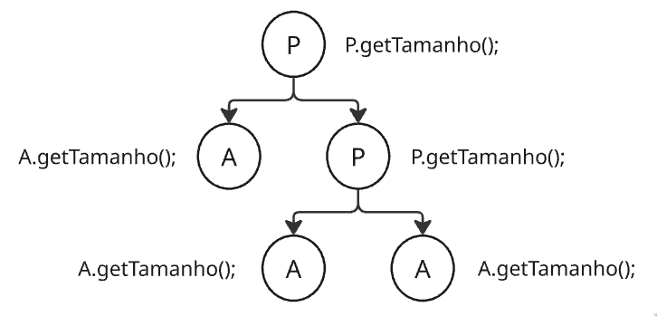
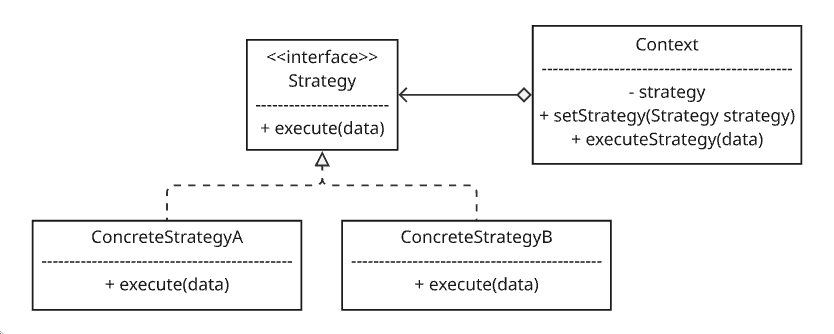

# Lista 2

## 1. Classificação GOF: Explique a diferença fundamental de intenção entre padrões Criacionais, Estruturais e Comportamentais.

- Os padrões __criacionais__ oferecem mecanismos de criação de objetos, os quais aumentam a flexibilidade e reutilização de código já existente.
    - Factory Method; Abstract Factory; Builder; Prototype; Singleton
- Os __estruturais__ explicam como compor classes e objetos em estruturas maiores e mais complexas. Focam na organização dos relacionamentos, garantindo que o sistema seja flexível, eficiente e fácil de manter.
    - Adapter; Bridge; Composite; Decorator; Facade; Flyweight; Proxy
- Os __comportamentais__ são as soluções focadas em algoritmos, comunicação e delegação de responsabilidades entre objetos. Facilitam a interação em sistemas, promovendo reutilização de código e reduzindo acoplamento.
    - Chain of Responsibility; Command; Iterator; Mediator; Memento; Observer; State; Strategy; Template Method; Visitor

## 2. Singleton: Por que o padrão Singleton é frequentemente considerado um "anti-padrão" em contextos de testes unitários e sistemas multitarefa?

O Singleton garante que uma classe tenha apenas uma instância, providenciando um ponto de acesso global a ela. É bom em casos como um objeto de banco de dados, onde é usado para evitar múltiplas conexões simultâneas, abertura e fechamento constantes de sessões e para economizar recursos de memória.

No entanto, no desenvolvimento moderno, nem sempre funciona bem. Quando usamos __testes unitários__, o objetivo é isolar o código e testá-lo independentemente e de forma determinística __(a entrada e saída devem sempre ser as mesmas)__. ==O Singleton dificulta esse processo, pois os testes irão modificar permanentemente o objeto Singleton==. Da próxima vez que o teste for rodado, os resultados serão diferentes.

Em __sistemas multitarefa__ o Singleton é considerado "anti-padrão" porque, neles, __várias threads rodam o código simultaneamente__. Deve haver um ==tratamento especial para evitar que 2 ou mais instâncias separadas do objeto Singleton não sejam criadas, quebrando a principal regra do padrão==. Também não é muito ideal, pois se várias threads precisarem ler dados desse Singleton o tempo todo, ==ficarão presas em filas==, diminuindo a escalabilidade e paralelismo do sistema.

## 3. Factory Method vs. Abstract Factory: Em qual situação você escolheria criar uma "família de objetos relacionados" em vez de apenas um objeto específico?

A diferença do Factory Method pro Abstract Factory é a escala do problema. Enquanto o Factory Method foca na criação de um tipo de objeto apenas, o Abstract Factory é uma classe/interface com métodos de fábricas diferentes, englobando a criação de vários objetos relacionados (família) através de composição, não herança simples.

- Factory Method: ==método abstrato== dentro de uma classe, usa ==herança==
- Abstract Factory: ==interface/classe== para ==outras fábricas==, usa ==composição==

## 4. Facade: Como o padrão Facade ajuda a reduzir o acoplamento entre um sistema complexo e seus clientes?

O Facade serve para trazer uma interface que abstrai o funcionamento de um sistema complexo, como uma biblioteca/framework. Quem utiliza o Facade não precisa saber os detalhes que o Facade sabe, diminuindo o acoplamento do cliente. O cliente conversa apenas com o Facade, sem chamar nada da biblioteca/framework diretamente.

## 5. Composite: Como o padrão Composite permite que clientes tratem objetos individuais e composições de objetos de maneira uniforme? (Exemplo: Pastas e Arquivos).

O Composite é usado quando queremos tratar os __objetos individuais__ e __coleções de objetos inteiras__ ==da mesma forma==. Temos uma interface comum entre pastas e arquivos, que é o que o cliente vê. Se o cliente chama ==pasta.getTamanho()== ou ==arquivo.getTamanho()==, os dois funcionarão da mesma forma da perspectiva do cliente. No entanto, arquivos e pastas implementam o mesmo método de suas próprias maneiras.

No caso, a pasta é uma coleção de arquivos ou outras pastas (é o objeto composto). A forma que o padrão Composite facilita o processo é que as ações de um objeto Composite são delegadas para os objetos individuais. No exemplo, o ==pasta.getTamanho()== é em essência ==um loop que chama o .getTamanho() de seus objetos==. Se for um arquivo, ele retornará seu tamanho, mas se for uma outra pasta (subpasta), ela irá também chamar o .getTamanho() do que tiver dentro dela.



## 6. Proxy: Diferencie um Proxy Remoto de um Proxy Virtual (Lazy Loading).

O Proxy remoto abstrai os detalhes da comunicação com ==objetos reais que estão em outro servidor, máquina ou processo externo==. O cliente interage com o Proxy como se estivesse falando com o objeto real. O proxy empacota e envia a requisição para o real, e depois recebe e entrega o pacote que o real processou. Assim, esconde-se do cliente detalhes sobre a transferência entre redes/processos diferentes.

O proxy virtual serve para gerenciar ==objetos que estão no mesmo servidor/máquina/processo, mas que são muito pesados para serem criados/carregados na memória ao mesmo tempo==. O cliente vê apenas proxies mais leves que o objeto real (por ex., uma __miniatura__ em vez de uma imagem em sua resolução completa), "escondendo" o custo da criação/carregamento e ==carregando somente quando necessário== (e.g. o cliente clicou para exibir a foto por completo), também chamado de Lazy Loading.

## 7. Strategy: Como o padrão Strategy permite eliminar grandes blocos de condicionais (if/else ou switch) em um código?

O Strategy pega uma classe que faz algo específico de maneiras diferentes e separa seus diferentes algoritmos em diferentes classes Estratégia. A classe original, o __contexto__, possui uma referência para a Estratégia geral (interface), delegando o trabalho para a estratégia selecionada pelo cliente, em vez de executar nela mesma.

Dessa forma, a classe Context não controla p fluxo de execução através de if-else ou switch-case, mas através de uma referência ao objeto Strategy selecionado. Sempre que for necessário criar uma estratégia nova, é só implementar de Strategy e criar sua própria estratégia, ==sem modificar a classe contexto diretamente==. Isso reduz acoplamento e facilita mudanças nas estratégias.



```java
// Strategy interface
public interface MathStrategy {
    int executeInt(int a, int b);
}

// Concrete Strategies
public class ConcreteMathStrategyAdd implements MathStrategy {
    @Override
    public int executeInt(int a, int b) {
        return a + b;
    }
}

public class ConcreteMathStrategyMultiply implements MathStrategy {
    @Override
    public int executeInt(int a, int b) {
        return a * b;
    }
}

// Context
public class MathContext {
    private MathStrategy strategy;

    public MathContext() {
        this.strategy = null;
    }

    public void setStrategy(MathStrategy strategy) {
        this.strategy = strategy;
    }

    public int executeStrategy(int a, int b) {
        if (this.strategy == null) {
            throw new IllegalStateException("Nenhuma estratégia foi definida!");
        }
        return this.strategy.executeInt(a, b);
    }
}

// em outro arquivo ...
public class Cliente {
    public static void main(String[] args) {
        MathContext context = new MathContext(); //instancia um objeto context

        int x = 10, y = 5;

        // quero somar
        context.setStrategy(new ConcreteMathStrategyAdd()); //instancia um ConcreteMathStrategyAdd que implementa do nosso Strategy
        int resultado = context.executeStrategy(x, y);
        System.out.println("Resultado da soma: " + resultado);
    }
}
```

## 8. Observer: Explique o fluxo de notação no padrão Observer (Subject e Observers). Como ele implementa o conceito de Loose Coupling?

No padrão observer, temos um sistema de inscrição e notificação de mudanças para os inscritos (como uma _newsletter_). O Subject (ou Publisher) é o objeto de interesse dos Observers (Subscribers). O Subject possui uma lista de Observers (objetos que implementam a interface Observer) e vai ter ==um loop que chama o método update de cada Observer==. O Subject não sabe os detalhes de como cada objeto lida com a informação nova (se vai enviar emails, se manda SMS, se atualiza uma base de dados...), o que ajuda a implementar o Loose Coupling (Acoplamento Fraco), pois ==o Subject depende somente da interface abstrata para interagir com seus ouvintes==.

## 9. State: No padrão State, quem é responsável pela transição de um estado para outro: o Contexto ou as subclasses de Estado? Justifique.

O responsável pela transição de estados ==pode ser o Contexto ou as subclasses Estado (concretas)==. Dependendo da aplicação, os Estados podem saber da existência de um do outro e disparar a transição de estado. Por exemplo, um Estado de venda "em processamento" que, após finalizar, muda o estado para "sucesso", o que altera o comportamento de um método realizarVenda(). Ou o próprio Contexto pode controlar a mudança de estados, centralizando a lógica de transições.

Em geral, no caso das subclasses controlarem a transição, o acoplamento entre elas aumenta, pois uma precisa conhecer e importar a outra para instanciá-la na transição. Já no caso do Contexto, os estados concretos (subclasses) são desacoplados, mas a classe Contexto terá maior complexidade.

## 10. Visitor: Por que o padrão Visitor é útil para adicionar operações a estruturas de objetos complexas sem alterar as classes desses objetos?

O padrão Visitor é usado quando queremos adicionar uma operação nova sobre uma estrutura de classes que já existe e não podemos alterar. Em vez de colocar a lógica da operação nova dentro das classes já existentes, criamos um objeto externo (Visitor) que irá percorrer cada elemento dessa estrutura executando a tarefa desejada.

Por exemplo, temos uma estrutura que representa os componentes de um computador: classes Processador, PlacaMae e MemoriaRam. O cliente pede pra criar uma funcionalidade de __gerar relatório de preço__ de cada peça. Em outro momento, ele pede pra criar um __relatório de consumo de energia__. Sem o visitor, teríamos que abrir cada classe, adicionar o método __calcularPreco()__, depois abrir tudo de novo e adicionar o __calcularConsumo()__. Isso violaria o OCP, pois teríamos que mudar as classes antes estáveis toda vez que vier um requisito novo.

Com o Visitor, só precisamos criar um método accept(Visitor visitor) dentro de cada classe __UMA ÚNICA VEZ__. Toda a lógica da visita vai para dentro de um ConcreteVisitor, que recebe um objeto do tipo Processador, PlacaMae ou MemoriaRam e realiza as operações necessárias.

## 11. Refactoring - Extract Method: Quando e por que devemos aplicar a refatoração "Extrair Método" em um código longo?

Aplicamos o Extract Method ==quando um método está muito longo, acumulando mais de uma responsabilidade, ou quando contém trechos de código duplicados ou difíceis de compreender==. O processo consiste em isolar esse bloco de código específico e movê-lo para um novo método independente, com um nome que descreva claramente o que ele faz.

Essa refatoração é feita para melhorar drasticamente a legibilidade e a manutenibilidade do sistema. Ela facilita a reutilização do código, ajuda a manter o SRP e simplifica a escrita de testes unitários, já que blocos lógicos menores são mais fáceis de isolar.

## 12. Refactoring - Replace Conditionals: Como o polimorfismo pode ser usado para refatorar expressões condicionais complexas baseadas em "tipos"?

O polimorfismo substitui condicionais complexas (if-else ou switch) baseadas em "tipos" criando uma subclasse específica para cada tipo sob uma interface ou classe abstrata comum. O comportamento que antes variava dentro dos blocos de decisão é movido para dentro de um método próprio implementado por cada uma dessas subclasses.

Em tempo de execução, em vez de o sistema checar manualmente o tipo do objeto através de condicionais, ele simplesmente invoca o método polimórfico direto na instância atual. Isso elimina o risco de esquecer de atualizar múltiplos switch-case espalhados pelo sistema e torna o código extensível, permitindo adicionar novos tipos apenas criando novas subclasses (respeitando o OCP).

## 13. Arquitetura em Camadas: Qual é a regra de ouro da comunicação entre camadas (quem pode conhecer quem) para evitar dependências circulares?

Na arquitetura em camadas clássica, a regra de ouro da comunicação é: uma camada superior pode conhecer e invocar os serviços da camada imediatamente inferior, mas uma camada inferior nunca deve conhecer ou depender de nenhuma camada que esteja acima dela.

Por exemplo, a camada de Interface pode chamar a camada de Negócio (Domínio), e esta pode chamar a camada de Acesso a Dados (Banco). Seguir essa regra rigidamente impede o acoplamento circular, garante o isolamento de responsabilidades e permite que uma camada seja alterada ou substituída sem gerar um efeito cascata nas demais.

> OBS: em designs modernos, isso é resolvido pelo DIP, onde ambas camadas inferiores e superiores dependem de abstrações advindas da camada de negócio (domínio), o que protege o núcleo da aplicação contra mudanças tecnológicas.

## 14. MVC: Explique o papel de cada componente no MVC. Por que o Controller não deve conter regras de negócio (domínio)?

No MVC, o __Model__ gerencia os dados, as regras de negócio e o estado da aplicação; a __View__ é responsável por renderizar as informações e apresentar a interface visual ao usuário; e o __Controller__ atua como o intermediário que intercepta as ações do usuário na View, repassa as instruções ao Model e decide qual View deve ser atualizada ou exibida em resposta.

O Controller não deve conter regras de negócio para garantir a orquestração limpa e o fluxo de controle. Se a lógica de domínio for colocada nele, o código fica altamente acoplado à interface do usuário, impedindo que essas mesmas regras de negócio sejam reaproveitadas em outros contextos (como em uma API, tarefas agendadas ou uma CLI) e dificultando o isolamento dos testes da lógica principal.

## 15. Microsserviços: Quais são as principais vantagens e os principais desafios (como transações distribuídas) ao migrar de um Monolito para Microsserviços?

A migração de um Monolito para Microsserviços traz como principais vantagens a ==escalabilidade independente== de cada componente do sistema, a ==flexibilidade para adotar diferentes tecnologias== para cada problema e a ==agilidade nos deploys==, já que falhas em um serviço não derrubam a aplicação inteira.

Por outro lado, os principais desafios envolvem a ==alta complexidade de rede e o monitoramento distribuído==. Além disso, gerenciar dados torna-se complexo: garantir a consistência eventual e coordenar transações distribuídas exige a implementação de padrões arquiteturais avançados (como o padrão Saga), já que não existe mais um banco de dados centralizado para garantir a atomicidade nativa (ACID).

## 16. Pub/Sub vs. Message Queues: Diferencie o modelo de entrega de mensagens "Ponto a Ponto" (Filas) do modelo "Publicação/Assinatura".

No modelo Ponto a Ponto (Message Queues), a entrega segue uma relação estrita de 1 para 1. Cada mensagem enviada por um produtor vai para uma fila e é consumida por apenas um único consumidor disponível. Assim que esse consumidor processa a mensagem e envia a confirmação, ela é permanentemente removida da fila.

No modelo Publicação/Assinatura (Pub/Sub), a relação é de 1 para muitos. O produtor envia a mensagem para um canal central (Tópico) e todos os consumidores que estiverem inscritos naquele canal recebem uma cópia idêntica da mensagem simultaneamente. Isso permite que sistemas diferentes processem o mesmo evento em paralelo e de forma totalmente independente.

## 17. Verificação vs. Validação: No contexto de QA, explique a frase: "Estamos construindo o produto corretamente? vs. Estamos construindo o produto correto?".

A ==Verificação== foca na conformidade técnica __durante o processo__ e responde a "Estamos construindo o produto corretamente?", garantindo que o software está sendo desenvolvido de acordo com as especificações técnicas, diagramas de arquitetura, requisitos formais e padrões de código preestabelecidos.

A ==Validação== foca na eficácia do __resultado final__ e responde a "Estamos construindo o produto correto?", avaliando se o software de fato resolve o problema real do usuário final, atende às expectativas de negócio e entrega o valor esperado no mundo real, independentemente de quão perfeito seja o código por trás dele.

## 18. TDD (Test Driven Development): Descreva o ciclo "Red-Green-Refactor" e explique por que a refatoração é um passo obrigatório no processo.

O ciclo do TDD é baseado no ciclo repetitivo Red-Green-Refactor: primeiro, escreve-se um teste de unidade para uma funcionalidade que ainda não existe (o teste falha - Red); em seguida, escreve-se o código mínimo e mais simples possível para fazer esse teste passar (o teste passa - Green); por fim, o código é limpo e reorganizado (Refactor).

A refatoração é um passo obrigatório porque, durante a fase Green, o único objetivo do desenvolvedor é fazer o teste passar rápido, o que frequentemente gera códigos mal estruturados, duplicados ou sem padrões de design. ==Sem a etapa de refatoração, o TDD falharia em seu propósito principal, acumulando dívida técnica e destruindo a qualidade da arquitetura do software a cada ciclo==.

## 19. Coberura de Código: Ter 100% de cobertura de código garante que o software está livre de bugs? Justifique sua resposta.

Não garante. 100% de cobertura de código significa apenas que todas as linhas e caminhos lógicos do software foram executados pelo menos uma vez durante a rodada de testes automatizados, mas isso não diz nada sobre a qualidade, a assertividade ou a eficiência das verificações feitas.

Os testes podem passar por todas as linhas do código sem realizar as asserções (asserts) corretas, podem ignorar combinações atípicas de dados de entrada que causariam falhas, e não blindam o sistema contra erros de lógica de negócio, condições de corrida em sistemas concorrentes ou problemas de integração com serviços externos. ==A cobertura mede quantidade de código executado em testes automáticos, não a ausência de bugs==.

## 20. Testes de Unidade vs. Integração: Qual a importância do uso de Mocks e Stubs em testes de unidade para garantir o isolamento do componente testado?

A importância de usar Mocks (objetos que simulam o comportamento de dependências reais e validam interações) e Stubs (objetos que apenas retornam dados fixos configurados para o teste) está em garantir o isolamento total do componente sob teste.

Ao substituir dependências do mundo real — como conexões com bancos de dados, chamadas a APIs externas ou sistemas de arquivos — por essas ferramentas, você garante que o teste unitário avalie apenas a lógica interna daquela unidade específica. Se o teste falhar, teremos a certeza de que o erro está na classe testada, e não em uma instabilidade de rede ou indisponibilidade de serviços externos, evitando que os testes de unidade virem testes de integração lentos e instáveis.
